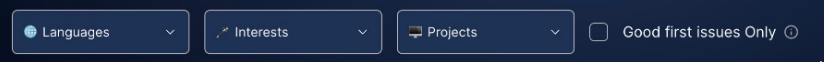
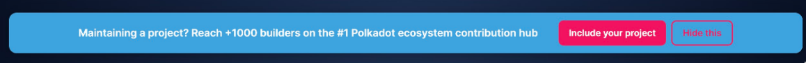
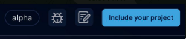
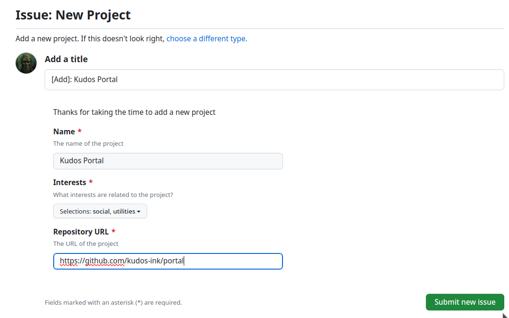

# Repositories Classification

This repository serves a collection of JSON files intended for use by the Kudos Portal.

## Filters

- [interests.json](data/interests.json) will be used in "Interests"
- [languages.json](data/languages.json) will be used in "Languages"
- [repository_full.json](data/repository_full.json) will be used in "Projects"

## Issues

Issues from repositories listed in [repository_full.json](data/repository_full.json) are retrieved by our backend services and displayed on the portal. Only repositories with a valid internal "id" are processed, a task manually carried out by the maintainers.

## Add your repository

When you click on any "Include your project" button, an issue will be opened, ready to be completed with your repository information.

Once submitted, the maintainers will review the submission, and it will then be included in our [repository_full.json](data/repository_full.json) file. The new issues associated with it will subsequently be displayed on our main portal. We will notify you through the issue when it is ready!

## Accept new repository (maintainers)

To accept a new repository, do the following steps:

1. Check that the values added in the issue does not exist in this file [repository.json](data/repository.json).
2. Execute the workflow "Import Issues" on this repository using the values from the issue.
3. Obtain from its output the "id".
4. Add a new entry here [repository.json](data/repository.json) with the 3 previous values, "interests" based on [interests.json](data/interests.json) and an emoji.
5. Once the changes arrived at **main** branch, they will appear in this file [repository_full.json](data/repository_full.json) so the website will start using the new repository.
