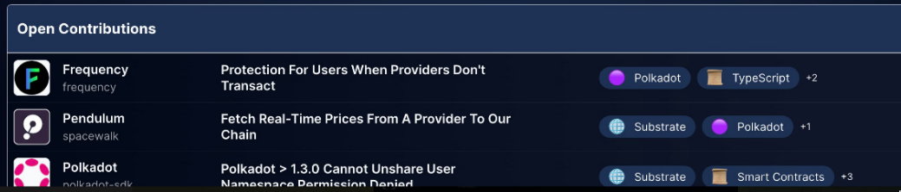

# Repositories Classification

## Description

This repository serves a collection of JSON files intended for use by the Kudos Portal. All the files used as a source of truth are placed in the [data](data/) folder. The files are used to load each **filter** in the website and also to retrieve the **issues** from our backend.

## Filters


- [languages.json](data/languages.json) will be used in "Languages"
- [interests.json](data/interests.json) will be used in "Interests"
- [repository_full.json](data/repository_full.json) will be used in "Projects"

## Issues



Issues from repositories listed in [repository_full.json](data/repository_full.json) are retrieved from our backend service and displayed on the portal. **Only repositories with a valid internal "id" are processed by the portal, a task manually carried out by the maintainers.**

## Add your repository in the portal

You're welcome to add your project in our portal! The steps to see your repository's issues in the portal are:

### You

1. Create an issue in this repository by clicking any button on the portal with the legend **Include your project** or using this [link](https://github.com/kudos-ink/repository-classification/issues/new?assignees=&labels=new-project&projects=&template=NEW_PROJECT.yaml&title=%5BAdd%5D%3A+)


### Maintainers

1. Add the repository to our backend service and load the issues using the [Import issues Workflow](https://github.com/kudos-ink/repository-classification/actions/workflows/import_issues.yaml). Save the Workflow's output called **id**
2. Add the new repository in the [repository.json](data/repository.json) file. Order matters! Use the following structure:
   ```json
    {
      "name": "",                // name of the project
      "emoji": "",               // a cool emoji
      "repository_url": "",      // the repository link from the issue
      "interests": ["", ""],     // the interests from the issue
      "id": ""                   // the id from step #1
    },
   ```
   1. Then, [repository_full.json](data/repository_full.json) will be updated by the [update repository workflow](.github/workflows/update_repositories.yaml)
   2. After that, new version of the serving will be deployed and portal's cache will be revalidated by the [json serving workflow](.github/workflows/json_serving.yml)
3. Comment on the issue where the repository was added and close it.
